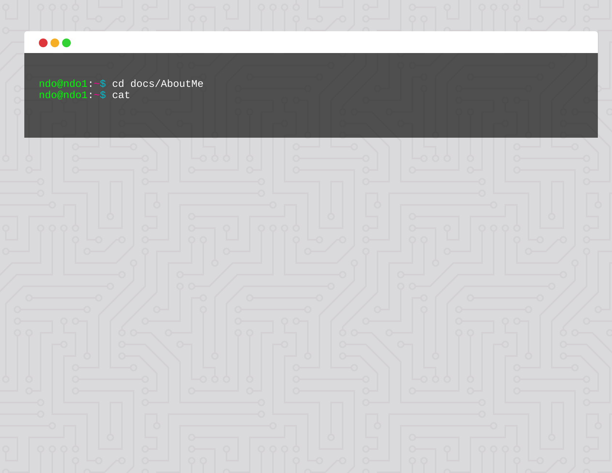

# 🖥️ Terminal Homepage

Pika/Web + Preact + Typescript Example Project



## 🚀 Getting Started

```bash
npm i
npm start
```

It will then be available at `localhost:5000`.

### 🙏 Special Thanks
[@pika/web](https://github.com/pikapkg/web)  
[preact](https://github.com/preactjs/preact)  
[dangodev/pika-web-preact](https://github.com/dangodev/pika-web-preact) 

---
📝 `License:` [`MIT`](https://opensource.org/licenses/MIT) 
